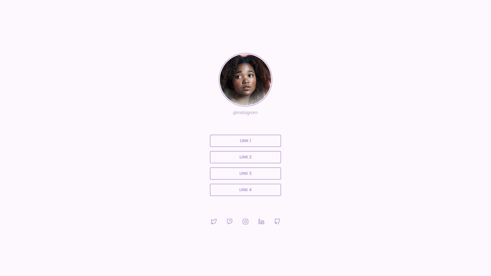

<h1 align="center">
  
</h1>

 

<h1> 
SOCIAL TREE 
</h1>

## ✨ Tecnologias

Esse projeto foi desenvolvido com as seguintes tecnologias:

- [Html](https://developer.mozilla.org/pt-BR/docs/Web/HTML)
- [Css](https://developer.mozilla.org/pt-BR/docs/Web/CSS)

## 💻 Projeto

Página com uma lista de links (menu) que pode ser usada em perfis de redes sociais para direcionar o usuário para o local escolhido.

## 🔖 Layout

Você pode visualizar o layout do projeto através [desse link](<https://www.figma.com/file/R7ixXT4iZFcYfCPyCvmWp7/DD-%2F-Social-links-(Copy)?node-id=0%3A1>). É necessário ter conta no [Figma](http://figma.com/) para acessá-lo.

## 🚀 Como executar

- Clone o repositório
- Rode a aplicação usando `Live Server`

## 📄 Licença

Esse projeto está sob a licença MIT. Veja o arquivo [LICENSE](LICENSE.md) para mais detalhes.
